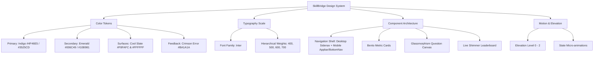
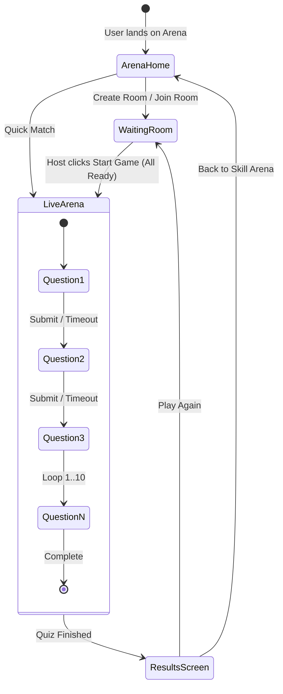

# SkillBridge Aptitude Arena - Comprehensive Design & UX Analysis

This document presents an in-depth architectural and aesthetic analysis of the **Aptitude Arena** module inside the SkillBridge AI Prep dashboard, based on the design system specifications (`DESIGN.md`) and the 4 primary workflow screens.

---

## 1. Executive Summary & Product Vision

The **Aptitude Arena** is a gamified, real-time assessment environment designed to prepare candidates for high-stakes technical, quantitative, and reasoning aptitude tests. 

### Core Product Objectives:
- **High-Utility & Low Friction**: Minimal cognitive load during rapid-fire problem solving.
- **Corporate Modern Aesthetic**: Blends the technical sophistication of agentic AI platforms (e.g., Linear, Stripe, Claude) with approachable education-focused feedback.
- **Engagement Loops**: Instant matchmaking, room codes for private peer battles, real-time standings with dynamic scores, and multi-dimensional performance telemetry.

---

## 2. Design System Architecture

### 2.1 Color Palette & Semantic Assignment

| Token Name | Hex Code | Semantic Role & Usage |
| :--- | :--- | :--- |
| `primary` | `#3525cd` / `#4f46e5` | Primary brand identity, primary call-to-action buttons, active navigation, question tracker active state |
| `primary-container` | `#4f46e5` / `#dad7ff` | Active menu pills, hero badge containers, selected option highlights |
| `secondary` | `#006c49` / `#10b981` | Success indicators, "Ready" user status, correct answer indicators |
| `secondary-container`| `#6cf8bb` / `#00714d` | Glow borders on ready state player cards |
| `surface` / `background`| `#f7f9fb` / `#f8fafc` | Soft canvas background that prevents eye fatigue during extended test prep |
| `surface-container-lowest`| `#ffffff` | Elevated interactive cards, inputs, leaderboard tables |
| `surface-container-low` | `#f2f4f6` | Inactive player slots, sidebar container backgrounds |
| `outline-variant` | `#c7c4d8` / `#e2e8f0` | 1px clean container borders, subtle table row dividers |
| `error` | `#ba1a1a` | Timer critical alert (< 15s remaining), incorrect answer badges |

### 2.2 Typography Scale (`Inter`)

| Style Role | Font Size | Line Height | Weight | Letter Spacing | Target Use Cases |
| :--- | :--- | :--- | :--- | :--- | :--- |
| `headline-xl` | 36px | 44px | Bold (700) | -0.02em | Page headers ("Aptitude Arena", "Game Complete") |
| `headline-lg` | 24px | 32px | Semi-Bold (600) | -0.01em | Question title, quick match headline, final score digits |
| `headline-md` | 20px | 28px | Semi-Bold (600) | Normal | Section headers ("Personal Stats", "Live Standings") |
| `body-lg` | 18px | 28px | Regular (400) | Normal | Subtitles, multiple-choice question text |
| `body-md` | 16px | 24px | Regular (400) | Normal | Default body copy, table cell content |
| `body-sm` | 14px | 20px | Regular (400) | Normal | Secondary subtitles, helper text, player status |
| `label-md` | 14px | 20px | Medium (500) | Normal | Button text, navigation links, table headers |
| `label-sm` | 12px | 16px | Semi-Bold (600) | +0.05em | Badges, stat titles ("GAMES PLAYED"), metadata pills |

---

## 3. Screen-by-Screen Breakdown & UX Patterns

### 3.1 Screen 1: Arena Home (`aptitude_arena_home`)
- **Navigation Shell**:
  - **Desktop**: 256px (`w-64`) fixed sidebar on the left with brand logo, student hub label, main navigation links (Home, Arena [Active], Progress, Settings), "Start Practice" CTA, and footer links (Help, Sign Out).
  - **Mobile**: Sticky top navigation bar with notification bell and avatar + bottom navigation bar with 4 core icons.
- **Matchmaking Hub**:
  - Split card with **Create Room** (host private match) on the left and **Join Room** (6-character uppercase PIN input) on the right.
  - High-impact **Quick Match** banner with gradient radial glow, bolt icon, and hover scale micro-interaction.
- **Bento Stat Grid**:
  - 4 key metrics: Games Played (24), Best Rank (#1), Accuracy (88%), Avg Response Time (22s).
- **Category Explorer**:
  - Logical Reasoning (Brain icon), Verbal Ability (Book icon), and Quantitative Aptitude (Calculator icon).

### 3.2 Screen 2: Waiting Room Lobby (`aptitude_waiting_room`)
- **Lobby Header**:
  - Title: "Elite Aptitude Room" with connected player count ("4/4 Players Connected").
  - Room Code pill ("7K4P9") with one-click copy button and toast confirmation.
- **Player Grid (2x2)**:
  - Custom player cards showing high-resolution avatars, ready status indicators (green checkmark badge + subtle left border glow), and host badge.
  - Waiting / Not Ready state with hourglass badge and dimmed grayscale styling.
- **Action Footer**:
  - Host-only "Start Game" CTA button that activates once players are ready.

### 3.3 Screen 3: Live Competition Arena (`aptitude_arena_live_competition`)
- **Live Arena Header**:
  - Room code indicator, participant count badge (e.g., "8 Participants"), and countdown timer badge with pulse animation (`01:07`).
- **Glassmorphism Question Canvas**:
  - Category pill ("Quantitative Aptitude") + Question progression index ("Question 4 of 10").
  - High-contrast question header with 4 interactive multiple choice tiles (A, B, C, D).
  - Hover states, active selection ring, and "Submitted" confirmation badge.
  - 10-dot question status indicator at the bottom (green = correct, red = incorrect, blue pulsing = current, gray = pending).
- **Live Leaderboard Sidebar**:
  - Ranked list of participants with dynamic scores.
  - Animated shimmering highlight on current player ("Rahul (YOU)").
  - Contextual motivation tip box with lightbulb icon.

### 3.4 Screen 4: Results & Analytics (`aptitude_arena_results`)
- **Trophy Banner**:
  - Gold trophy icon, "Game Complete" headline, and session conclusion summary.
- **5-Metric Bento Summary**:
  - Final Rank (#2), Total Score (395), Overall Accuracy (80%), Correct Answers (8/10), and Average Response Time (34s).
- **Category Breakdown Analytics**:
  - Visual completion bars for Logical Reasoning (80%), Verbal Ability (90%), and Quantitative Aptitude (70%).
- **Final Leaderboard Table**:
  - Ranked table with star badge for the current user and comparative response speeds.
- **Action CTAs**:
  - "Play Again" primary button and "Back to Skill Arena" secondary button.

---

## 4. User Journey & State Transitions

